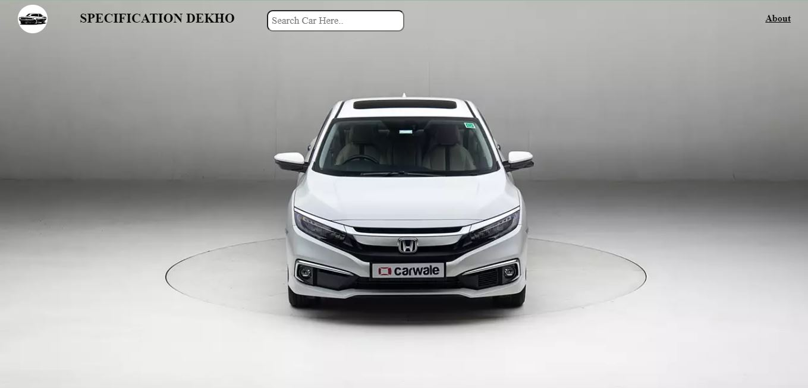

# Honda Civic 360 View

This project is created to **learn JavaScript** and **demonstrate its functionality**. It showcases how to build a simple 3D view using HTML, CSS, and JavaScript.This project provides an interactive 360-degree view of a Honda Civic using HTML, CSS, and JavaScript. The viewer allows users to rotate the car model to view it from all angles using keyboard controls.

## Screenshots

Here are some screenshots of the game:

## Usage

Interact with the View

Use the **right arrow key** to rotate the car view clockwise.                  
Use the **left arrow key** to rotate the car view counterclockwise.

## Features

- Rotate the Honda Civic 360 degrees.
- Smooth and responsive interaction.
- Control rotation using the right and left arrow keys.
- Simple setup and integration.

## Getting Started

To use this project, follow these steps:
 Open `index.html` in a web browser to start.

### Prerequisites

- A modern web browser (e.g., Google Chrome, Firefox, Safari).
- Basic understanding of HTML, CSS, and JavaScript.

